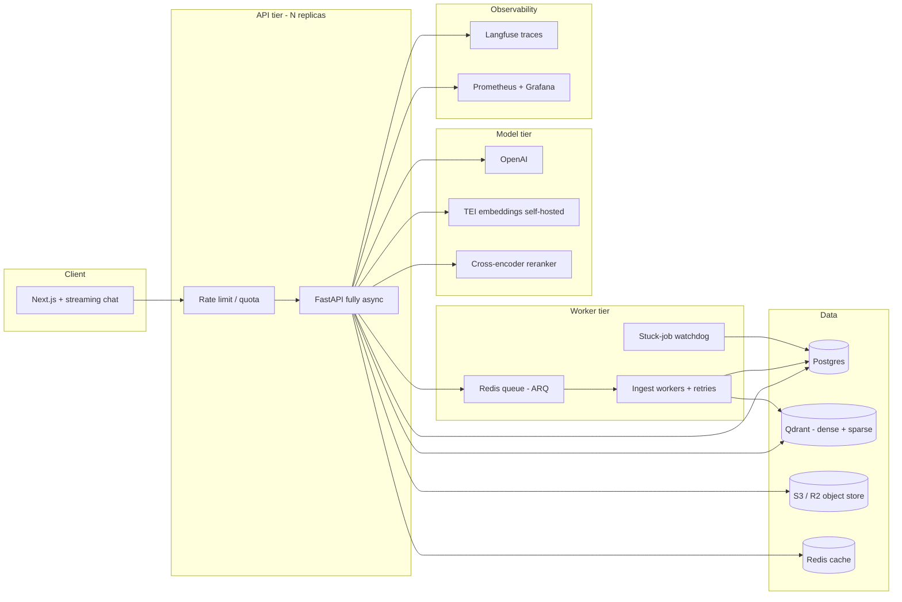

# Roadmap: from RAG demo to RAG platform

This document is the forward-looking companion to [tech-architecture.md](tech-architecture.md). That file describes what exists today and why; this one describes what to build next, in what order, and what to read while doing it.

For runbooks (install, env vars, smoke tests), see the [README](../README.md). For how to learn and build CI/CD on this repo (concepts, GitHub Actions, staged homework, resource links), see [ci-cd.md](ci-cd.md).

---

## 1. The goal that drives every decision

The optimization target is **not more features**. It is depth that can be defended under questioning, which means the roadmap is sequenced to produce *measurements*, not a longer feature list.

The finish line looks like three claims that hold up for thirty minutes of follow-up questions:

> Built a multi-tenant RAG platform over PDFs. Raised retrieval Recall@5 from X to Y on a 50-question golden set via token-aware chunking, hybrid search and cross-encoder reranking — each change validated by an offline eval harness running in CI. Cut p95 ask latency from A to B and cost per query by C% by fixing event-loop blocking, batching embeddings, and adding a semantic cache; the service sustains N concurrent users across 3 replicas with a durable Redis-backed ingest queue.

Two consequences follow from this framing:

1. **The eval harness (Phase 1) and the cost/latency instrumentation (Phase 2) are the highest-leverage work in this document.** A RAG demo is common; a RAG demo with a golden set, regression tests on retrieval quality, and a known dollar cost per query is rare.
2. **Correctness fixes come before features.** A reviewer who opens [documents.py](../src/ai_doc_qa/api/routes/documents.py) and finds a blocking call in an async route will discount every scalability claim that follows it. Phase 0 exists to remove that.

---

## 2. Known gaps in the current implementation

Recorded here so they are not rediscovered later. Each maps to a task below.

| Area | Issue | Impact |
|------|-------|--------|
| Concurrency | `ask_doc` calls `RAGService.run()` synchronously inside an `async def`, and the RAG/LLM/embedding/retrieval services use the **sync** `OpenAI` client | The event loop is blocked for the whole embed + completion round trip. Effective concurrency on `ask` is 1. `search` avoids this with `asyncio.to_thread`; `ask` does not |
| Security | `/test-upload` in [main.py](../src/ai_doc_qa/main.py) is unauthenticated and builds its path as `UPLOAD_DIR / file.filename` from a client-controlled filename | Arbitrary-path write (traversal) |
| Security | JWT is stored in `localStorage` ([frontend/lib/auth.tsx](../frontend/lib/auth.tsx)), with no refresh or revocation path | Any XSS exfiltrates a valid credential; no way to invalidate it before expiry |
| Retrieval quality | `StructureAwareChunker.split_section` splits only on markdown headings and ignores its own `chunk_size` / `overlap` arguments | A long single-heading section becomes one chunk, which can exceed the 8191-token embedding limit and badly degrades retrieval precision |
| Performance | `QdrantService()`, `RetrievalService()` and `RAGService()` are constructed inside request handlers | Fresh HTTP/TLS clients per request; no shared connection pool |
| Maintainability | `os.getenv` + `load_dotenv()` are repeated across five service modules; root `.env.example` is empty | No single source of truth for configuration; deployment is guesswork |
| Durability | Ingest runs in FastAPI `BackgroundTasks` in-process, with no retries and no watchdog | A crash or restart mid-ingest strands documents in `processing` forever |
| Scale-out | PDFs are written to local disk under `uploaded_documents/` | Two API replicas cannot see each other's files; caps the service at one instance |
| Engineering hygiene | No tests, no CI, no linting gate | Regressions are invisible; nothing enforces the tenancy guarantees |
| Operability | No tracing, no metrics, no token/cost accounting, no rate limiting or quotas | Cannot answer "how slow is it", "what does it cost", or "who is abusing it" |

---

## 3. Target architecture



The differences from today's architecture are: a worker tier behind a durable queue instead of in-process background tasks, object storage instead of local disk, Redis for caching and quotas, sparse vectors alongside dense ones in Qdrant, a pluggable model tier, and an observability path out of every request.

---

## 4. Phase 0 — Correctness and foundations (~1 week)

Small, unglamorous, and blocking. Everything here is a prerequisite for the claims made in later phases.

- **Fix the blocking ask.** Convert [services/llm/service.py](../src/ai_doc_qa/services/llm/service.py), [services/embedding/service.py](../src/ai_doc_qa/services/embedding/service.py), [services/retrieval/service.py](../src/ai_doc_qa/services/retrieval/service.py) and [services/rag/service.py](../src/ai_doc_qa/services/rag/service.py) to `AsyncOpenAI` and `AsyncQdrantClient`, make `RAGService.run` a coroutine, and `await` it in `ask_doc`. **Benchmark p95 before and after** — this is the headline latency number for Phase 2's write-up, so capture the "before" while it still exists.
- **Delete `/test-upload`** from [main.py](../src/ai_doc_qa/main.py). Also remove the `if __name__ == "__main__"` scratch blocks left in the service modules; one of them calls a `emb.get_embedding` method that no longer exists, which is a signal that dead code is not being exercised.
- **One config object.** Add `core/config.py` built on `pydantic-settings` with a cached `get_settings()`, and delete the scattered `load_dotenv()` / `os.getenv` calls. Fill in the empty root `.env.example` from the environment contract in [tech-architecture.md](tech-architecture.md#11-environment-contract).
- **Client singletons.** Construct the Qdrant and OpenAI clients once in a FastAPI `lifespan`, store them on `app.state`, and inject them with `Depends` instead of instantiating services inside handlers.
- **Tests and CI.** `pytest` + `pytest-asyncio` + `httpx.ASGITransport`, with Postgres and Qdrant supplied by `testcontainers-python` and the OpenAI client faked. Minimum meaningful set:
  - the register → login → authenticated-request flow;
  - **cross-tenant isolation** — user A must receive 404, not 403 or 200, for user B's document id, on get, delete, search and ask;
  - chunker unit tests (including the oversized-section case that currently fails);
  - ingest happy path, and a failure path that asserts the document ends as `failed` with `error_message` populated.

  Then a GitHub Actions workflow running `ruff`, `mypy` and `pytest` on every push. A passing CI badge in the README carries disproportionate weight relative to the effort. Walk through the *why* and the learning path in [ci-cd.md](ci-cd.md) rather than copying a finished workflow.

**Resources:** [FastAPI async and concurrency](https://fastapi.tiangolo.com/async/) · [FastAPI lifespan events](https://fastapi.tiangolo.com/advanced/events/) · [pydantic-settings](https://docs.pydantic.dev/latest/concepts/pydantic_settings/) · [testcontainers-python](https://testcontainers-python.readthedocs.io/) · [pytest-asyncio](https://pytest-asyncio.readthedocs.io/) · [CI/CD guide](ci-cd.md) · [uv in GitHub Actions](https://docs.astral.sh/uv/guides/integration/github/) · [GitHub Actions: Understanding](https://docs.github.com/en/actions/get-started/understand-github-actions)

---

## 5. Phase 1 — Make retrieval good, and prove it (~3 weeks)

This is the phase that differentiates the project. **Build the eval harness before making any retrieval change**, otherwise every improvement is a guess. "I added reranking" is a weak claim; "reranking moved nDCG@5 from 0.61 to 0.78 at a cost of 90ms" is a strong one.

### 5.1 Eval harness first

- **Golden dataset.** 40-60 `(question, ideal_answer, expected_chunk_ids)` triples across 6-10 deliberately varied PDFs: a technical spec, a research paper, a table-heavy report, a scanned document, something multi-column. Draft candidates with an LLM, then **hand-verify every row**. This verification step is the part that gets skipped and it is where the value is.
- **Retrieval metrics** — Recall@k, MRR, nDCG@k. Deterministic and cheap, so they can run on every pull request.
- **Generation metrics** — faithfulness/groundedness, answer relevance and citation correctness, via LLM-as-judge with a strong model, plus deterministic checks that every `[Source N]` cited actually exists in the retrieved set.
- **Packaging.** Ship as `uv run python -m ai_doc_qa.evals.run`, write results to a versioned JSON under `docs/`, and gate CI on retrieval-metric regressions.

### 5.2 Then fix the chunker

Replace heading-only splitting with token-aware recursive splitting (`tiktoken`, roughly 400-600 tokens with ~15% overlap) that **prepends the heading path to each chunk** so an isolated chunk retains its context. Capture `page_number` and `heading_path` onto `document_chunks` and into the Qdrant payload — this upgrades citations from `[Source 2]` to "page 14, §3.2 Rate Limits", which is simultaneously a retrieval-quality win and a visible product improvement.

### 5.3 Then improve retrieval, one change at a time

Re-run the evals after each step and keep an honest log, **including the changes that did not help**:

1. **Hybrid search** — sparse/BM25 alongside the dense vectors in Qdrant, fused with Reciprocal Rank Fusion.
2. **Cross-encoder reranking** — retrieve top-50, rerank to top-5 (`bge-reranker-v2-m3` locally, or Cohere Rerank).
3. **Query transformation** — multi-query expansion or HyDE for follow-up and vague questions.
4. **Contextual retrieval** — an LLM-written context prefix per chunk before embedding.

"I tried HyDE, it cost 300ms for +0.01 nDCG, so I removed it" demonstrates more engineering judgement than any feature list. Record those results.

### 5.4 Product wins that ride along

- **Workspace-wide ask** across all of a user's documents — today `ask` is scoped to a single document.
- **SSE streaming answers**, end to end through the Next.js frontend. Perceived latency improvement is large and it forces the async work from Phase 0 to be genuinely correct.
- **Conversation memory** — `conversations` and `messages` tables, plus follow-up query rewriting so "what about the second one?" is resolved into a standalone question before retrieval.

**Resources:** [Anthropic — Introducing Contextual Retrieval](https://www.anthropic.com/news/contextual-retrieval) · [Hamel Husain — Your AI Product Needs Evals](https://hamel.dev/blog/posts/evals/) and [Creating an LLM-as-a-Judge](https://hamel.dev/blog/posts/llm-judge/) · [Ragas](https://docs.ragas.io/) · [DeepEval](https://deepeval.com/docs/getting-started) · [Jason Liu — systematically improving RAG](https://jxnl.co/writing/) · [Qdrant hybrid queries](https://qdrant.tech/documentation/concepts/hybrid-queries/) · Chip Huyen, *AI Engineering* (evaluation and RAG chapters)

---

## 6. Phase 2 — Serve it at scale, and instrument it (~3 weeks)

- **Durable ingest.** Replace `BackgroundTasks` ([utils/task.py](../src/ai_doc_qa/utils/task.py)) with **ARQ** — Redis-backed, async-native, and a natural fit for this codebase. Celery is the more widely recognized alternative if name recognition matters more than fit. Add exponential-backoff retries, a dead-letter path, SHA-256 content idempotency so re-uploading a file does not re-embed it, and a **watchdog that reaps documents stuck in `processing`** past a threshold.
- **Object storage.** Move PDFs to S3 or Cloudflare R2, with MinIO in Docker Compose for local development, using presigned uploads so the API never streams file bytes. This is the specific change that unlocks more than one API replica.
- **Redis caching and quotas.** An embedding cache keyed by content hash (a real cost saving on re-ingest), a semantic answer cache, per-user token-bucket rate limiting, and a monthly token budget per user.
- **Cost and token accounting.** Record prompt and completion tokens plus computed USD into a `usage_events` table on every LLM call, and expose `GET /usage`. Being able to state the marginal cost of one question is a strong and uncommon signal.
- **Observability.** Langfuse (self-hostable, free) tracing every retrieval and generation with latency, tokens and cost; OpenTelemetry with Prometheus and Grafana for HTTP and queue metrics; Sentry for errors; structured JSON logs with a request ID propagated from the API into worker jobs.
- **Load testing.** k6 or Locust against `ask`, reporting p50/p95/p99 and the RPS at which errors begin — **measured both before and after the Phase 0 async fix**. That contrast is the single most persuasive artifact in the project.
- **Deployment.** Multi-stage Dockerfile, `/health/live` and `/health/ready` probes, then API + worker + Redis on Fly.io or Railway, Postgres on Neon, Qdrant Cloud, frontend on Vercel. Scale to 3 API replicas and re-run the load test to prove the shared-state fixes actually worked. Do this only after CI is a merge gate; the learning path is [ci-cd.md](ci-cd.md) Stage 5.
- **Auth hardening.** Refresh-token rotation in httpOnly cookies, a revocation list, and email verification — replacing the `localStorage` access token.

**Resources:** [ARQ](https://arq-docs.helpmanual.io/) · [Celery task best practices](https://docs.celeryq.dev/en/stable/userguide/tasks.html) · [Langfuse](https://langfuse.com/docs) · [OpenTelemetry Python](https://opentelemetry.io/docs/languages/python/) · [k6](https://grafana.com/docs/k6/latest/) · [Prometheus FastAPI instrumentator](https://github.com/trallnag/prometheus-fastapi-instrumentator) · Martin Kleppmann, *Designing Data-Intensive Applications* (chapters 1-5) · [CI/CD guide — Stage 5](ci-cd.md#stage-5--continuous-delivery-only-after-ci-is-boring) · [Vercel Git](https://vercel.com/docs/git) · [Publishing Docker images (Actions)](https://docs.github.com/en/actions/use-cases-and-examples/publishing-packages/publishing-docker-images)

---

## 7. Phase 3 — Depth (pick one or two, ~2-3 weeks)

**The self-hosted model tier is the highest-signal option**, because it forces engagement with the actual vocabulary of serving LLMs at scale — continuous batching, KV cache, throughput versus latency tradeoffs.

- **Self-hosted model tier.** Serve embeddings through HuggingFace **TEI** and generation through **vLLM** on a rented GPU, behind a provider interface so OpenAI remains a config flip. Then benchmark quality (using the Phase 1 evals), latency, and dollars per million tokens against OpenAI. A conclusion like "OpenAI is cheaper below roughly 2M tokens/month; self-hosting wins above it" is a genuinely senior-sounding result.
- **Hard-document ingestion.** OCR for scanned PDFs (RapidOCR/Tesseract, or a vision model over page images), DOCX/PPTX/HTML via Docling or Unstructured, and table extraction. Tables are a well-known RAG failure mode, and the eval harness will quantify the gain.
- **Organizations and sharing.** `organizations` and `memberships` tables, roles, and `org_id` threaded through the Qdrant payload and every filter — a real multi-tenancy exercise rather than a cosmetic one.
- **Agentic mode.** A tool-calling agent that plans multi-document lookups and compares sources, with a step budget and guardrails.

**Resources:** [vLLM](https://docs.vllm.ai/) (read the continuous batching and PagedAttention pages) · [Text Embeddings Inference](https://huggingface.co/docs/text-embeddings-inference/) · [Docling](https://docling-project.github.io/docling/)

---

## 8. How to present the work

- Maintain a `docs/benchmarks.md` holding the eval tables and load-test results, committed as it changes so the before/after history is visible in git.
- Add a "Results" section to the README pointing at it. Lead with numbers rather than stack names; two quantified bullets outperform six feature bullets.
- Write one short post per phase. "How I found out my async FastAPI endpoint was actually single-threaded" is both publishable and rehearsal for the interview question it invites.

---

## 9. Order of attack

```
Phase 0 (all of it)
  → eval harness
  → chunker rewrite
  → hybrid search + reranking, measured
  → streaming + conversations
  → queue + object storage + observability
  → load test + cloud deploy
  → one Phase 3 depth item
```

Phase 0 is one week and gates the credibility of everything after it, so it is not optional. Within Phase 1, the eval harness genuinely must come first — its purpose is to tell you which of the subsequent changes were worth making.

---

## 10. Task checklist

**Phase 0 — foundations**

- [ ] Convert LLM, embedding, retrieval and RAG services to `AsyncOpenAI` + `AsyncQdrantClient`; `await` in `ask_doc`; record p95 before and after
- [ ] Delete the unauthenticated `/test-upload` route and the `__main__` scratch blocks
- [ ] Add `core/config.py` with `pydantic-settings`; populate root `.env.example`
- [ ] Move client construction into `lifespan` + `app.state`, injected via `Depends`
- [ ] Add the pytest suite: auth flow, cross-tenant isolation, chunker units, ingest success and failure
- [ ] Add GitHub Actions CI running ruff, mypy and pytest

**Phase 1 — retrieval quality**

- [ ] Build and hand-verify the 40-60 question golden set
- [ ] Implement the eval CLI (Recall@k, MRR, nDCG, LLM-as-judge faithfulness); gate CI on retrieval regressions
- [ ] Rewrite the chunker: token-aware, heading-path-preserving; persist `page_number` and `heading_path`
- [ ] Add hybrid dense + sparse search with RRF; measure
- [ ] Add cross-encoder reranking; measure
- [ ] Try query rewriting / HyDE; measure and record the outcome either way
- [ ] Add SSE streaming answers end to end
- [ ] Add workspace-wide multi-document ask
- [ ] Add conversation memory with follow-up query rewriting

**Phase 2 — scale and instrumentation**

- [ ] Replace `BackgroundTasks` with ARQ workers: retries, dead-letter, SHA-256 idempotency, stuck-job watchdog
- [ ] Move PDF storage to S3/R2 with presigned uploads (MinIO locally)
- [ ] Add Redis embedding cache, semantic answer cache, rate limits and per-user token quotas
- [ ] Add `usage_events` token/USD accounting and a `GET /usage` endpoint
- [ ] Add Langfuse tracing, OpenTelemetry + Prometheus + Grafana, Sentry, request-ID logging
- [ ] Run k6 load tests; publish p50/p95/p99 before versus after the async fix
- [ ] Deploy API + worker + Redis + Postgres + Qdrant to the cloud; scale to 3 replicas and re-test
- [ ] Move the JWT to httpOnly cookies with refresh rotation, revocation and email verification

**Phase 3 — depth (choose one or two)**

- [ ] Self-hosted TEI + vLLM model tier, benchmarked against OpenAI on quality, latency and cost
- [ ] OCR and multi-format ingestion (DOCX/PPTX/HTML, tables)
- [ ] Organizations, memberships and document sharing
- [ ] Agentic multi-document mode with a step budget

**Ongoing**

- [ ] Keep `docs/benchmarks.md` current with eval tables and load-test charts
- [ ] Publish one write-up per phase
