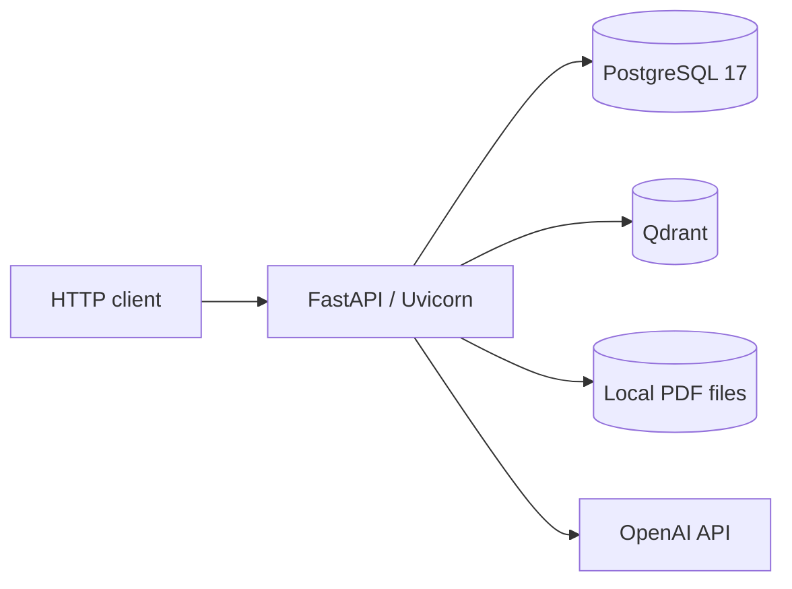
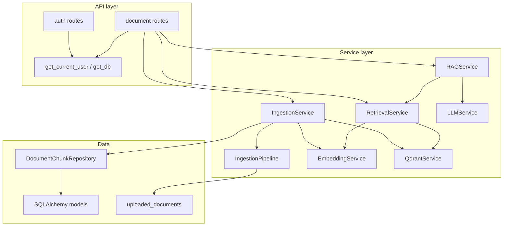
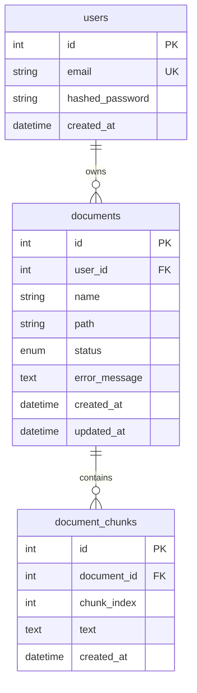
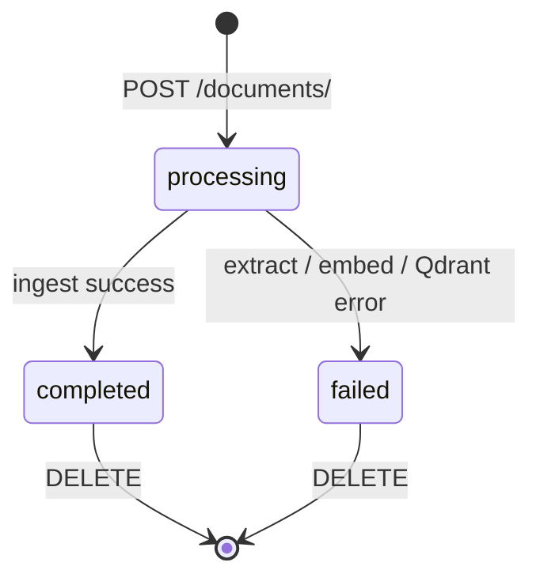
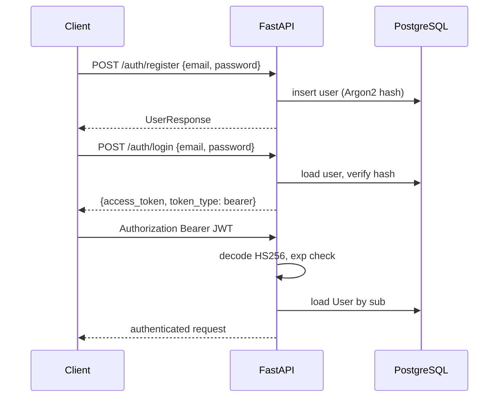
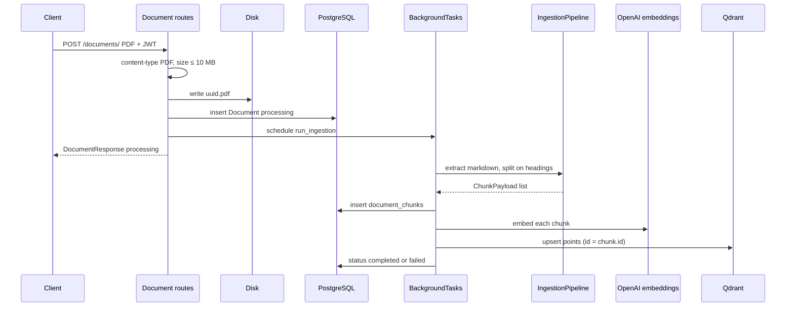
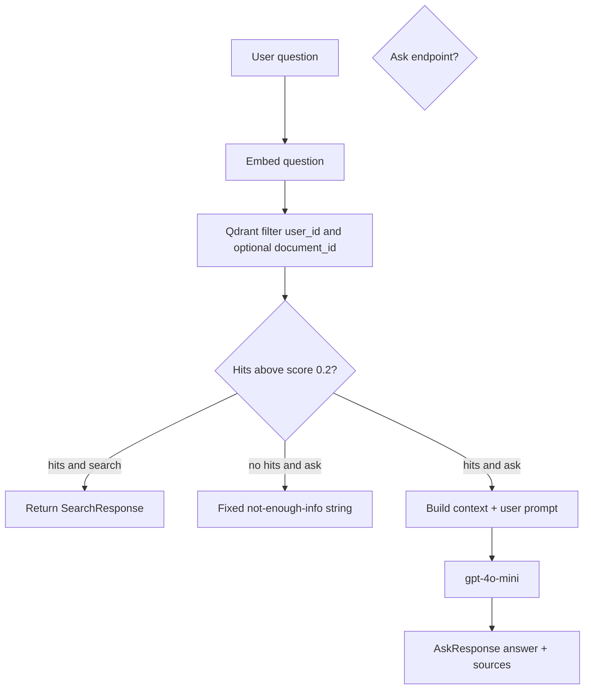

# Technical architecture

This document describes **AI Doc QA**: a FastAPI backend that lets users upload PDFs, index them, and ask questions against their own documents using retrieval-augmented generation (RAG).

For runbooks (install, env vars, smoke tests), see the [README](../README.md). This file is the *why* and *how* of the system. For what to build next, see [roadmap.md](roadmap.md). For CI/CD on this repo, see [ci-cd.md](ci-cd.md).

---

## 1. What the product does

A registered user can:

1. Upload a PDF (max 10 MB).
2. Wait until the document status becomes `completed`.
3. **Search** semantically across their chunks (optionally scoped to one document).
4. **Ask** a question about a single completed document and get an answer grounded in retrieved text.

The API never answers from general model knowledge when sources are missing. The LLM is instructed to use only retrieved context, and if retrieval returns nothing usable, the service returns a fixed “not enough information” message without calling the model.

Search and ask are **user-scoped**. Qdrant filters always include `user_id`, so one tenant cannot retrieve another tenant’s vectors.

---

## 2. High-level architecture

The system is a **single FastAPI process** talking to three kinds of storage and one cloud AI provider:

| Concern | Where it lives | Role |
|---------|----------------|------|
| Identity, document metadata, chunk text | PostgreSQL | Source of truth for users, documents, and chunk bodies |
| Dense vectors + payload for ANN search | Qdrant | Similarity search at query time |
| Original PDFs | Local disk (`uploaded_documents/`) | Bytes for extraction; not used at ask time |
| Embeddings and chat completions | OpenAI API | `text-embedding-3-small` and `gpt-4o-mini` |

**Why this split:** relational data (users, ownership, status, audit timestamps, full chunk text) belongs in Postgres. Approximate nearest-neighbor search over 1536-d embeddings belongs in a vector database. Mixing both in one store is possible (pgvector) but Qdrant is dedicated to filtered vector search, ships with a dashboard, and keeps ANN concerns out of the OLTP schema. Disk is used because ingestion is a local pipeline; object storage would be the natural next step for multi-instance deploys.

---

## 3. Tech stack and rationale

### 3.1 Language and packaging

| Choice | Why |
|--------|-----|
| **Python 3.11+** | Native `asyncio`, typed syntax used throughout, and the ecosystem for PDF, embeddings, and FastAPI is Python-first. |
| **uv** | Fast, lockfile-based installs (`uv.lock`) and a single tool for venv + deps, instead of pip + poetry + pyenv glue. |
| **src layout** (`src/ai_doc_qa`) | Package is installed as `ai_doc_qa`, so imports stay stable and tests/scripts do not accidentally import from a loose `ai_doc_qa/` folder on `sys.path`. |

### 3.2 HTTP layer

| Choice | Why |
|--------|-----|
| **FastAPI** | Async routes, first-class Pydantic v2 models, OpenAPI at `/docs`, and `Depends` for auth and DB sessions. |
| **Uvicorn** | ASGI server FastAPI expects; `--reload` for local development. |
| **Pydantic schemas** (`schemas/`) | Request validation (length limits, `extra="forbid"` on search/ask) and response shaping, separate from SQLAlchemy models. |
| **python-multipart** | Required for `UploadFile` PDF uploads. |

FastAPI was chosen over Django/Flask because the workload is I/O-bound (DB, Qdrant, OpenAI) and the public surface is a JSON API, not a server-rendered app.

### 3.3 Persistence

| Choice | Why |
|--------|-----|
| **PostgreSQL 17** | Reliable ACID store for users, documents, and chunks; `ON DELETE CASCADE` from user → documents → chunks. |
| **SQLAlchemy 2 async** | Mapped models, `AsyncSession`, and the same ORM for routes and repositories. `expire_on_commit=False` so objects remain usable after commit (needed after upload). |
| **psycopg 3** (`postgresql+psycopg://`) | Async-capable driver matching SQLAlchemy’s async engine. |
| **Alembic** | Versioned schema (`users`, `documents`, `document_chunks`, `error_message`). Schema changes are not `create_all` in production. |

**Connection pooling:** the async engine uses `pool_size=20` and `max_overflow=0` so the app does not silently open unbounded connections against local Postgres.

### 3.4 Vector search

| Choice | Why |
|--------|-----|
| **Qdrant** | HTTP API, payload filters (`user_id`, `document_id`), cosine distance, and a local Docker image. Point IDs are the Postgres `document_chunks.id` values so vector rows and SQL rows share an identity. |
| **Cosine distance** | Standard for OpenAI embedding spaces; scores are comparable for a score threshold (`0.2` in search). |
| **Payload denormalization** | Each point stores `text`, `user_id`, `document_id`, `chunk_index` so retrieval does not join back to Postgres on the hot path. |

**Why not pgvector in this project:** Postgres already holds chunk text. pgvector would collapse two systems into one, which is simpler operationally, but Qdrant keeps vector indexing, collection lifecycle, and filtered ANN isolated. The tradeoff is dual-write consistency (see [§8](#8-consistency-and-failure-modes)).

### 3.5 Embeddings and generation

| Choice | Why |
|--------|-----|
| **OpenAI embeddings** (`text-embedding-3-small`, 1536 dims by default) | Strong quality/cost for English document Q&A; dimension is configurable but **must** match the Qdrant collection size. |
| **gpt-4o-mini** | Cheap, fast answers for grounded Q&A; `temperature=0.2` to reduce creative drift. |
| **Grounding prompt** | System prompt forbids answering outside sources and requires `[Source N]` citations. Empty retrieval short-circuits the LLM call. |

Local embedding models (e.g. sentence-transformers) would remove the API key dependency and keep data on-box, at the cost of ops (GPU/CPU, model files) and likely worse quality for the same latency budget. This project optimizes for a small backend with a single OpenAI key.

### 3.6 PDF ingestion

| Choice | Why |
|--------|-----|
| **PyMuPDF / pymupdf4llm** | Fast native PDF parse; `to_markdown()` preserves headings so chunking can split on `#` … `######`. |
| **Heading-aware chunker** | RAG quality is better when a chunk is a coherent section rather than an arbitrary character window. A sliding-window `BasicChunker` exists in the same module but is **not** used on the ingest path. |

Markdown extraction is a deliberate trade: layout-heavy PDFs (multi-column, scanned images) will extract poorly. OCR is out of scope.

### 3.7 Auth and security

| Choice | Why |
|--------|-----|
| **JWT access tokens** (HS256, 30-minute expiry) | Stateless auth for a single API; `sub` is the user id. No refresh-token rotation yet. |
| **OAuth2PasswordBearer** | Clients send `Authorization: Bearer <token>`. Note: login itself is **JSON** (`email`/`password`), not the OAuth2 form `username`/`password` that Swagger’s “Authorize” button expects unless adapted. |
| **Argon2 via pwdlib** | Password hashing with a modern KDF (`PasswordHash.recommended()`), not bcrypt-by-hand. |
| **Per-user document queries** | List/get/delete/ask always constrain `Document.user_id == current user`. |
| **Qdrant `user_id` filter** | Defense in depth if a document id were guessed. |

### 3.8 Async and background work

| Choice | Why |
|--------|-----|
| **FastAPI `BackgroundTasks`** | Upload returns immediately with `status=processing`; extract/embed/upsert run after the response. Avoids blocking the HTTP request on OpenAI + PDF work. |
| **Dedicated DB session in the task** | `run_ingestion` opens `AsyncSessionLocal()` itself. The request session from `get_db` must not be reused after the request ends. |
| **`AsyncOpenAI` / `AsyncQdrantClient`** | Shared clients created in FastAPI `lifespan` ([client.py](../src/ai_doc_qa/client.py)) and injected with `Depends`. `ask` and `search` `await` embed + completion instead of blocking the event loop. |
| **`asyncio.to_thread`** | PyMuPDF / pymupdf4llm is still sync; ingestion offloads `IngestionPipeline.run` so the loop stays free. |

This is **in-process** background work. If the process dies mid-ingest, the document can remain `processing` or be marked `failed`. A durable queue (Celery, ARQ, Redis) is the usual upgrade.

### 3.9 Local infrastructure

| Choice | Why |
|--------|-----|
| **Docker Compose** | One command for Postgres 17 and Qdrant with named volumes. |
| **Postgres on host 5433** | Avoids clashing with a local Postgres on 5432. |
| **aiofiles** | Listed as a dependency for async file I/O; current upload path still uses a sync `open()` in a loop (acceptable for 10 MB). |

---

## 4. Logical architecture (layers)

**Convention:** routes own HTTP status codes and ownership checks. Services own pipelines. Repositories own SQL for chunks. Utils own JWT and password hashing.

---

## 5. Data model

**Document status** is a small state machine:

- `processing`: row exists, PDF is on disk, background ingest running (or stuck if the process crashed).
- `completed`: chunks in Postgres, vectors in Qdrant; search/ask allowed.
- `failed`: `error_message` stores the exception string; search/ask return **409**.

Qdrant is not in the ER diagram. Each point is `{ id: chunk.id, vector, payload: { user_id, document_id, chunk_index, text } }`.

---

## 6. Runtime flows

### 6.1 Authentication

### 6.2 Upload and ingestion

Upload is designed so the HTTP response does **not** wait for embeddings.

Steps inside `IngestionService.process_document`:

1. `IngestionPipeline.run` in a thread: `pymupdf4llm.to_markdown` → `StructureAwareChunker.split_section`.
2. `DocumentChunkRepository.create_chunks` commits chunk rows (needed so Qdrant point IDs exist).
3. `EmbeddingService.get_embeddings` (`AsyncOpenAI`, shared client from lifespan).
4. `QdrantService.upsert_chunks` (ensures collection, cosine, 1536-d).
5. Set `completed`, or `failed` + `error_message` and re-raise.

### 6.3 Search vs ask

**Search** (`POST /documents/search`) is retrieval only: embed the question, cosine search, return hits (score, text, document_id, chunk_id). Optional `document_id` adds a Qdrant filter and a Postgres readiness check.

**Ask** (`POST /documents/{id}/ask`) is RAG: retrieve (always filtered to that document + user) → format `[Source i]` blocks → `LLMService.generate` with `RAG_SYSTEM_PROMPT`.

Default retrieval `limit` is 5 (max 20 on search). Score threshold `0.2` drops weak cosine matches before they reach the client or the LLM.

---

## 7. Component reference

| Module | Responsibility |
|--------|----------------|
| `main.py` | App factory, routers, `GET /`, `GET /health/db`. |
| `api/routes/auth.py` | Register, login. |
| `api/routes/documents.py` | CRUD, upload, search, ask; file type/size limits. |
| `api/dependencies.py` | JWT → `User`. |
| `db/db.py` | Async engine, session factory, `get_db`. |
| `db/models/*` | `User`, `Document`, `DocumentChunk`. |
| `services/ingestion/extractor.py` | PDF → markdown. |
| `services/ingestion/chunker.py` | Heading splits (and unused basic chunker). |
| `services/ingestion/pipeline.py` | Extract + chunk → `ChunkPayload`. |
| `services/ingestion/repository.py` | Persist chunks. |
| `services/ingestion/service.py` | Full ingest orchestration + status. |
| `utils/task.py` | Background task + **new** DB session. |
| `services/embedding/service.py` | OpenAI embeddings. |
| `services/vector_store/qdrant.py` | Collection, upsert, search, delete by document. |
| `services/retrieval/service.py` | Embed query + Qdrant search. |
| `services/llm/service.py` | Chat completion. |
| `services/rag/prompt.py` | System + user prompt templates. |
| `services/rag/service.py` | Retrieve → prompt → generate. |
| `utils/jwt.py` | Create/decode access tokens. |
| `utils/security.py` | Hash/verify passwords. |

---

## 8. Consistency and failure modes

The design is **dual-write**: Postgres chunks then Qdrant points.

| Failure | What the user sees |
|---------|--------------------|
| Invalid PDF type / oversize | 400 / 413; file removed if the row was not committed. |
| Extract / embed / Qdrant error in background | Document `failed` with `error_message`; HTTP upload already returned 200 with `processing`. Client must poll `GET /documents/{id}`. |
| Process crash during ingest | Status may stay `processing` forever (no watchdog). |
| Delete | Qdrant points for that `user_id` + `document_id` are deleted, then the SQL row (cascade removes chunks), then the PDF file. |

Search/ask on a non-`completed` document return **409**. Retrieval exceptions return **503**. Missing or foreign documents return **404** (not 403), so existence of another user’s ids is not confirmed.

---

## 9. Isolation and tenancy

There is no organization or sharing model. Isolation is:

1. JWT `sub` → current user.
2. SQL `WHERE user_id = current_user.id`.
3. Qdrant `must` filter on `user_id` (and `document_id` when asking or when search is scoped).

A single Qdrant collection (`document_chunks` by default) holds all users’ vectors; isolation is filter-based, not collection-per-user.

---

## 10. What this architecture is optimized for

- A **single-node** API with Dockerized Postgres + Qdrant.
- Clear service boundaries for a learning/production-shaped RAG backend.
- Fast upload UX via background ingest.
- Grounded answers rather than an unbounded chatbot.

It is **not** yet optimized for:

- Horizontal API replicas sharing uploads (local disk is not shared).
- Durable ingest jobs and retries.
- Refresh tokens, rate limiting, or a dedicated auth service.
- Scanned PDFs / OCR.
- Streaming answers or conversation memory.
- Measured retrieval quality (golden set / evals) or a published p95 for `ask`.

Those would extend this layout rather than replace the Postgres + Qdrant + OpenAI core. Phase 0 added tests, CI, async clients, and a single settings object; Phase 1 is evals + chunker quality.

---

## 11. Environment contract

| Variable | Purpose |
|----------|---------|
| `POSTGRES_URL` | SQLAlchemy async URL (`postgresql+psycopg://...`). |
| `JWT_SECRET` / `JWT_ALGO` | Token signing (HS256). |
| `ACCESS_TOKEN_EXPIRE_MINUTES` | Access-token lifetime. |
| `OPENAI_API_KEY` / `OPENAI_MODEL` | Embeddings and ask (`gpt-4o-mini` by default). |
| `EMBEDDING_MODEL` / `EMBEDDING_DIMENSIONS` | Must match Qdrant vector size. |
| `QDRANT_URL` / `QDRANT_COLLECTION` | Vector store endpoint and collection name. |

Config is loaded through `get_settings()` in [settings.py](../src/ai_doc_qa/settings.py) (not at import time). Changing embedding dimensions after data exists requires recreating the Qdrant collection and re-ingesting documents.
